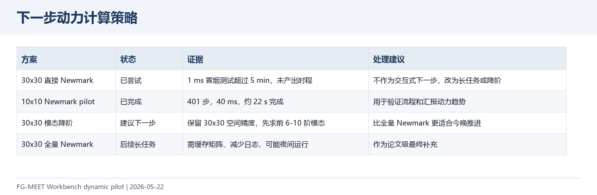
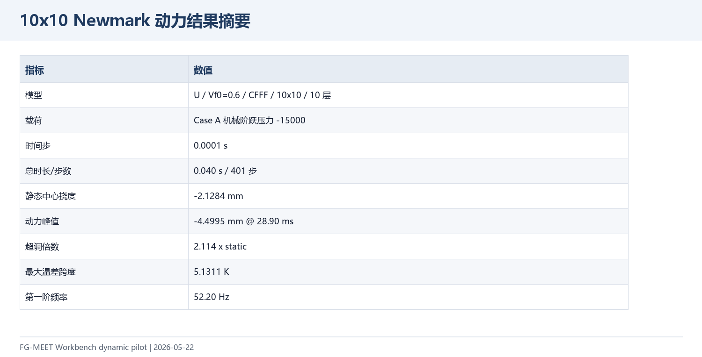
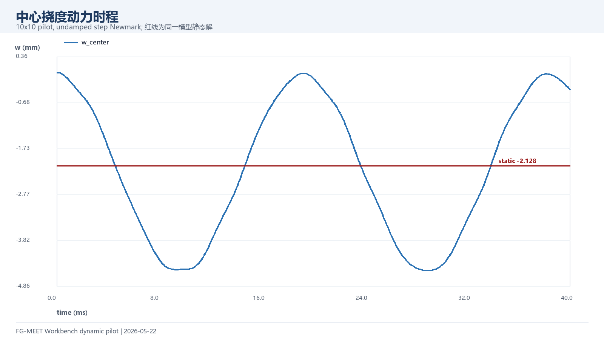
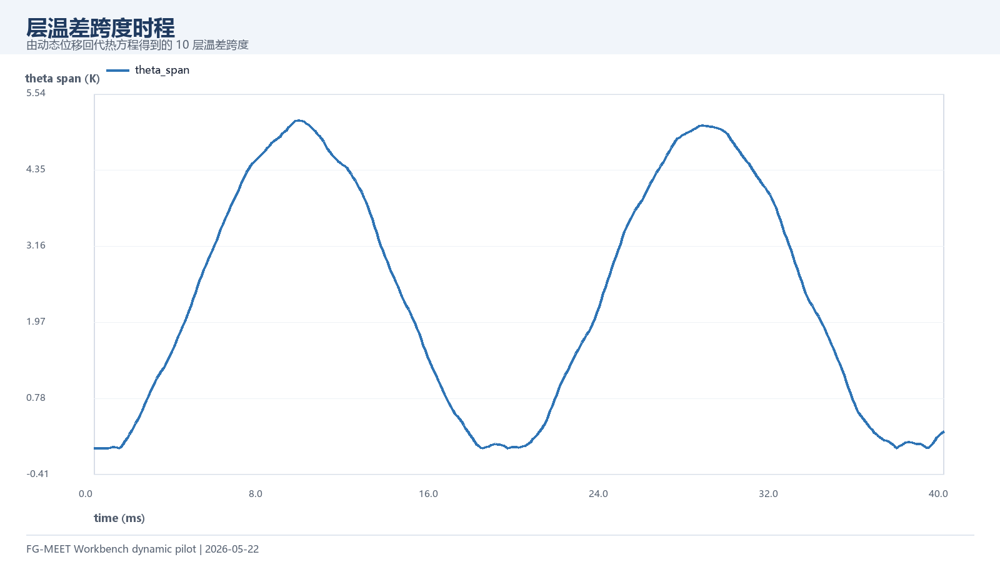
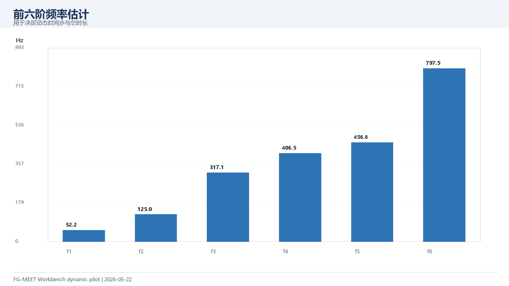

# 动力代表算例结果补充（2026-05-22）

本页是静力/COMSOL 汇报之后的下一步结果：先用已有 Newmark 动力函数跑通一个可复现的代表算例，并记录为什么 30x30 全量动态不适合作为交互式计算入口。

## 1. 结论

| 项目 | 结果 |
| --- | --- |
| 当前可用结果 | 10x10 / U / Vf0=0.6 / CFFF / Case A 阶跃动力响应 |
| 计算规模 | 401 步，0.1 ms 步长，总时长 40 ms |
| 静态中心挠度 | -2.1284 mm |
| 动力峰值 | -4.4995 mm，出现在 28.90 ms |
| 超调倍数 | 2.114 × 静态挠度 |
| 最大温差跨度 | 5.1311 K |
| 第一阶频率 | 52.20 Hz |

## 2. 结果图

## 3. 如何继续

当前 10x10 结果用于证明动态入口、中心自由度映射、时程输出和热响应回代都已经打通。30x30 全量 Newmark 冒烟测试在 1 ms 时程下超过 5 分钟未完成，因此下一步建议走“30x30 模态降阶”：保留 30x30 的空间模型，先求前 6-10 阶模态，再用模态叠加生成中心时程。这样比每步直接解 13800 自由度全矩阵更适合今晚继续产出。

更新：30x30 模态降阶已经完成，详见 `../2026-05-22-modal30x30/README.md`。当前 8 阶结果的模态静态捕获比例为 1.00037，动力峰值为 -4.4279 mm。

## 4. 文件索引

| 文件 | 用途 |
| --- | --- |
| `data/dynamic_U_Vf06_elastic_10x10_timeseries.csv` | 401 步中心挠度和 10 层温差时程 |
| `data/dynamic_U_Vf06_elastic_10x10_summary.csv` | 峰值、超调、频率等摘要 |
| `figures/*.png` | 可直接截入 PPT 的结果图 |
| `../../run_dynamic_representative.m` | 动态代表算例统一入口 |
