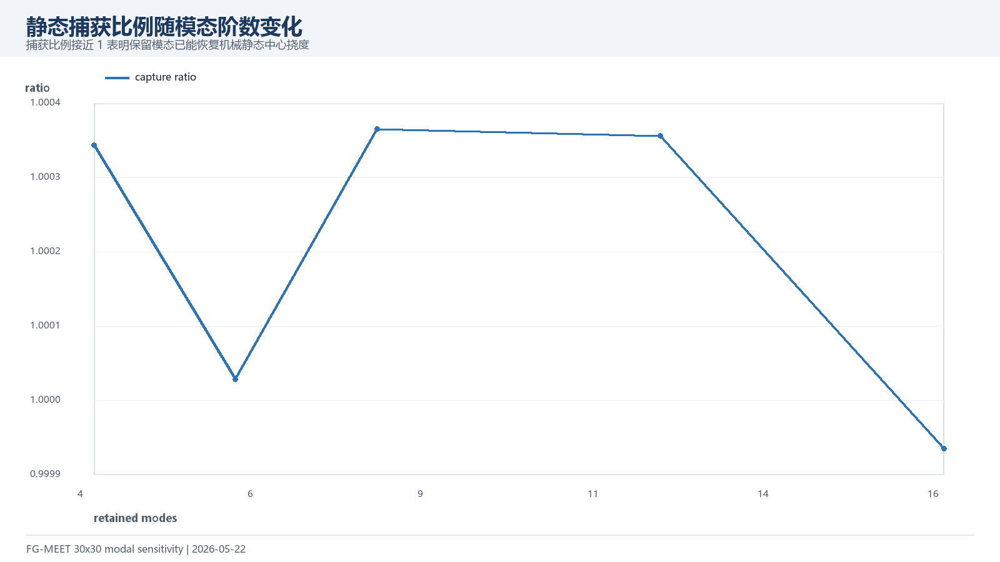
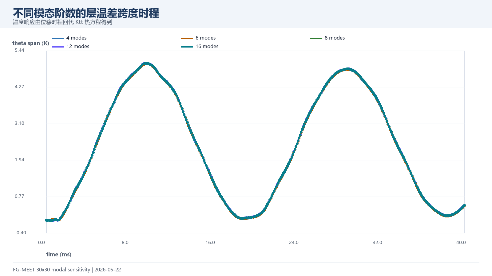
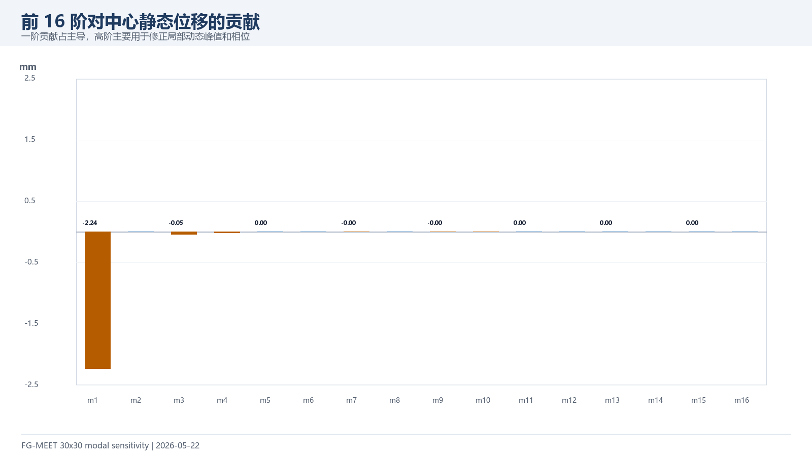
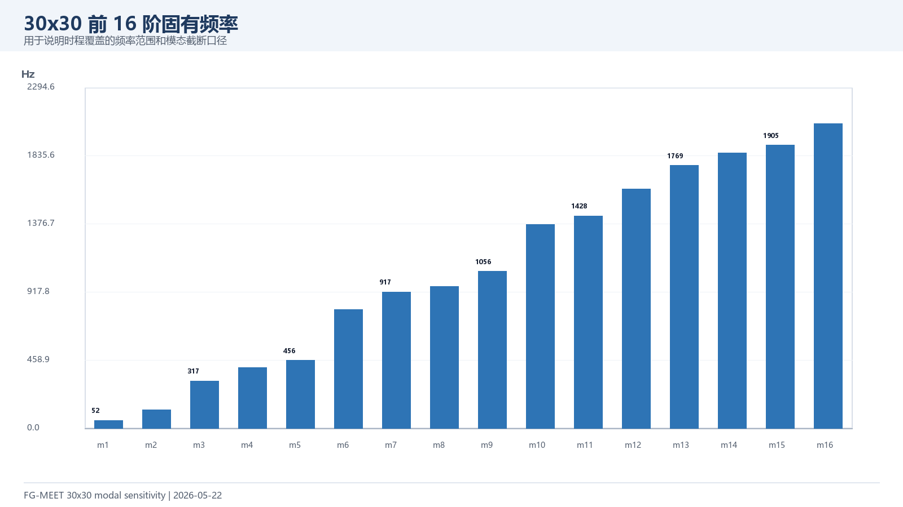

# 30x30 模态阶数敏感性分析（2026-05-22）

本报告是在 30x30 8 阶模态动力结果之后补充的收敛性检查。计算方式为：30x30 模型只装配一次，只求一次前 16 阶固有模态，然后分别保留 4, 6, 8, 12, 16 阶重构中心挠度时程，并通过 `Ktt \ (-Ktu*u)` 回代得到层温差跨度。

## 1. 核心结论

| 阶数 | 静态捕获比例 | 动力峰值 mm | 峰值时间 ms | 超调倍数 | 最大 θ 跨度 K |
| --- | ---: | ---: | ---: | ---: | ---: |
| 4 | 1.000349 | -4.4281 | 9.50 | 1.930 | 5.0256 |
| 6 | 1.000053 | -4.4271 | 9.60 | 1.929 | 5.0276 |
| 8 | 1.000370 | -4.4279 | 9.50 | 1.930 | 5.0398 |
| 12 | 1.000361 | -4.4278 | 9.50 | 1.930 | 5.0398 |
| 16 | 0.999965 | -4.4270 | 9.60 | 1.929 | 5.0363 |

最高阶（16 阶）当前结果为：峰值 -4.4270 mm，峰值时间 9.60 ms，最大层温差跨度 5.0363 K。与 8 阶相比，16 阶峰值绝对值变化 +0.0009 mm，最大 θ 跨度变化 +0.0035 K。

## 2. 收敛趋势

## 3. 时程对比

## 4. 模态信息

## 5. 组会讨论口径

当前建议：把 16 阶作为 30x30 模态降阶的更稳妥结果展示，8 阶作为阶段性快速结果保留。后续如继续追论文最终图，可补阻尼比敏感性（例如 0、0.5%、0.8%、1.5%）和夜间长时程 Newmark 对照。

## 6. 文件索引

| 文件 | 用途 |
| --- | --- |
| `data/dynamic_modal_30x30_U_Vf06_elastic_sensitivity_timeseries.csv` | 不同阶数的中心挠度、温差跨度和 10 层温度时程 |
| `data/dynamic_modal_30x30_U_Vf06_elastic_sensitivity_summary.csv` | 各阶数峰值、超调、静态捕获比例与运行时间 |
| `data/dynamic_modal_30x30_U_Vf06_elastic_sensitivity_modes.csv` | 前 16 阶频率、模态力、中心静态贡献 |
| `figures/*.png` | 可直接截取进 PPT 的图片 |
| `../../run_dynamic_modal_sensitivity_30x30.m` | 本次敏感性计算入口 |
