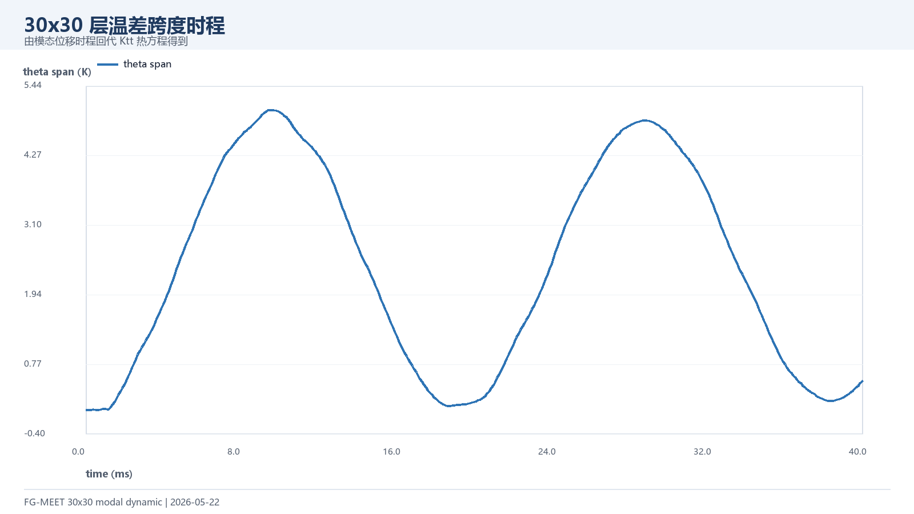
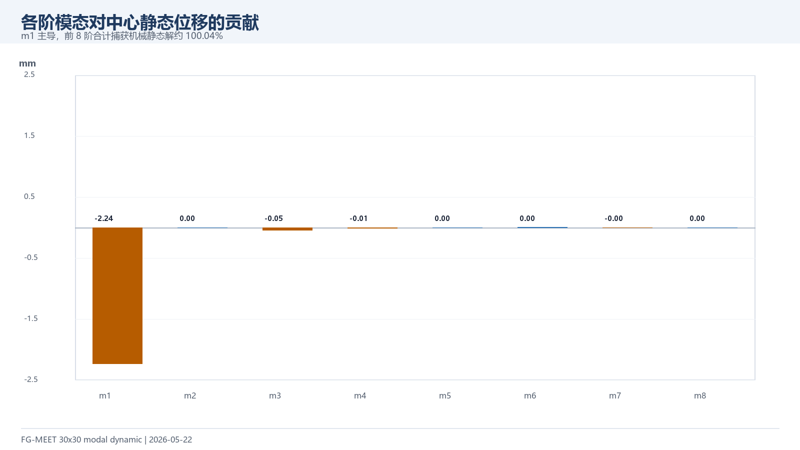
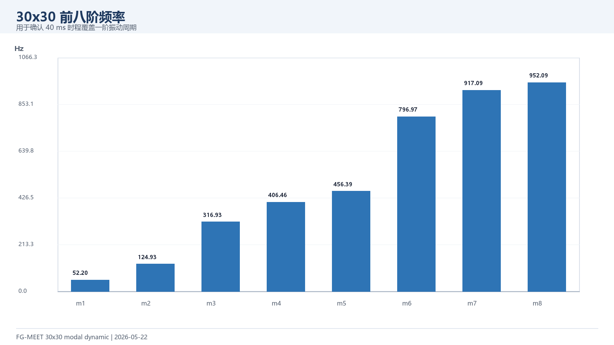

# 30x30 模态降阶动力结果（2026-05-22）

本结果是在 10x10 Newmark pilot 之后继续推进的 30x30 动力计算。直接 30x30 全量 Newmark 在 1 ms 冒烟测试中超过 5 分钟未产出时程，因此这里采用 30x30 机械模态叠加：先求前 8 阶，再由模态响应重构中心挠度，并回代热方程得到层温差。

## 1. 核心结论

| 项目 | 结果 |
| --- | --- |
| 计算方法 | 30x30 全模型 + 8 阶模态叠加 + 热响应回代 |
| 计算时长 | 约 7.6 min |
| 耦合静态中心挠度 | -2.1275 mm |
| 机械静态中心挠度 | -2.2947 mm |
| 模态静态捕获 | -2.2955 mm，捕获比例 1.000370 |
| 动力峰值 | -4.4279 mm，出现在 9.50 ms |
| 超调倍数 | 1.930 × 机械静态解 |
| 最大温差跨度 | 5.0398 K |
| 第一阶频率 | 52.20 Hz |

## 2. 时程与模态

## 3. 与 10x10 pilot 对比

10x10 Newmark 和 30x30 模态的第一阶频率非常接近：10x10 为 52.20 Hz，30x30 为 52.20 Hz。差异主要来自方法口径：10x10 pilot 是完整 Newmark、无阻尼；30x30 模态结果使用 0.8% 阻尼并保留前 8 阶，峰值更适合作为 30x30 后续论文图的基础版本。

## 4. 后续阶数敏感性

已继续补算 4/6/8/12/16 阶模态敏感性，报告见 `../2026-05-22-modal-sensitivity/README.md`。16 阶结果为峰值 -4.4270 mm、峰值时间 9.60 ms、最大层温差跨度 5.0363 K；与 8 阶峰值差约 0.0009 mm，说明 8 阶结果已基本收敛。

## 5. 文件索引

| 文件 | 用途 |
| --- | --- |
| `data/dynamic_modal_30x30_U_Vf06_elastic_8modes_timeseries.csv` | 401 步中心挠度与 10 层温差时程 |
| `data/dynamic_modal_30x30_U_Vf06_elastic_8modes_summary.csv` | 峰值、静态捕获、频率等摘要 |
| `data/dynamic_modal_30x30_U_Vf06_elastic_8modes_modes.csv` | 前 8 阶频率和中心位移贡献 |
| `figures/*.png` | 可直接截入 PPT 的图片 |
| `../../run_dynamic_modal_30x30.m` | 30x30 模态降阶动力入口 |
