# FG-MEET Workbench 月度/组会汇报材料（2026-05-22）

> 用途：明天组会可直接截取表格和图片做 PPT。本文按“模型目标 → 预计方法 → 实际问题 → 解决路径 → 正确/错误结果展示”的逻辑组织。

## 0. 一页结论

| 项目 | 结论 |
| --- | --- |
| 主模型 | 300 mm × 300 mm × 6 mm FG-MEE CFFF 方板，30×30 八节点板壳，10 层材料 |
| MATLAB 主算例 | 5 种 FG × 9 个 Vf0 × 3 个载荷 = 135 行静力结果 |
| 2 mm 转化验证 | 6 个检查项全部 pass，覆盖电势、磁势、机械回代和沈式直接矩阵法 |
| COMSOL 最终模型 | 10 层 CSV 分域材料 + swept quad/hex 网格，mesh size 4，每层 7 个扫掠单元 |
| 最终误差 | 中心点 3.771%，15 点最大 4.927%，平均 3.513% |
| 动力补充 | 10×10 Newmark 峰值 -4.4995 mm；30×30 16 阶模态峰值 -4.4270 mm |
| 阻尼敏感性 | 0/0.5/0.8/1.5% 已补算；0.8% 口径峰值 -4.4270 mm |
| 仍待推进 | 论文 main.tex 尚未建立；如需论文最终动态图，建议补夜间长时程 Newmark 对照 |

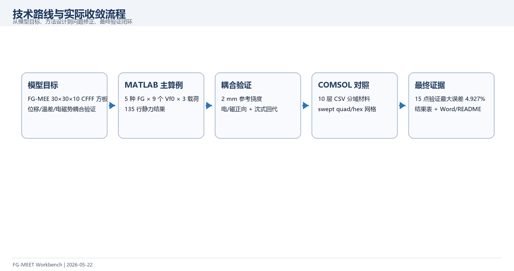

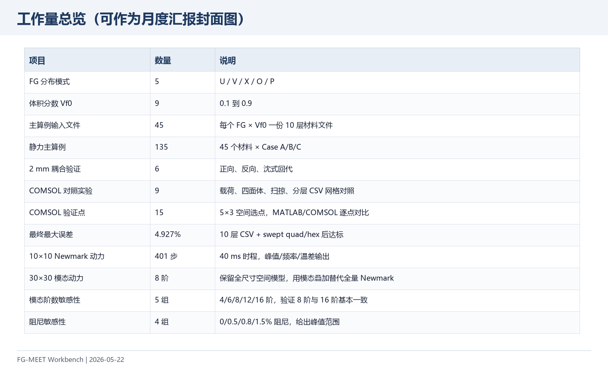

## 1. 模型是什么，要完成的目标

| 条目 | 说明 |
| --- | --- |
| 几何 | 方板 300×300×6 mm，CFFF 单边固支三边自由 |
| 材料 | BaTiO3/CoFe2O4 功能梯度磁-电-弹性材料，厚度方向 10 层 |
| 变量 | 位移 w、温差/热响应 theta、电势响应、磁势响应 |
| 主载荷 | Case A 机械压力 15000 Pa；Case B 上下 ±300 V；Case C 上下 ±200 A 磁势 |
| 验证目标 | MATLAB MEET 主程序批量求解；代表工况用 COMSOL 独立验证，关键误差 <5% |

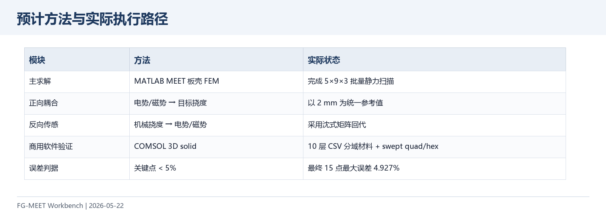

## 2. 预计使用的计算、仿真方法

本阶段采用 MATLAB 作为主求解器，COMSOL 只做代表性对照，不承担 45×3 全量扫描。这样既保留板壳全耦合程序的效率，也能给组会/论文提供商用软件独立验证证据。

| 模块 | 实现 | 目的 |
| --- | --- | --- |
| MATLAB 静力扫描 | run_batch_static.m | 完整参数矩阵，输出挠度、温差、磁电效率 |
| 2 mm 转化验证 | run_coupling_validation_2mm.m | 统一参考挠度，验证正向驱动和反向传感 |
| 沈式回代 | [Kff,Kfz;Kzf,Kzz]\[-Kfu*u-Kft*T;-Kzu*u-Kzt*T] | 从位移场直接回算感生电/磁势 |
| COMSOL 对照 | Java API + comsolbatch | 绕开 LiveLink 登录依赖，可命令行复现 |
| 动力计算 | Newmark pilot + 30×30 模态降阶 | 先验证频率/峰值，再做阶数敏感性 |
| 结果汇报 | Markdown + Word/PDF + 图片化表格 | 便于直接截取到 PPT |
## 3. 实际途中遇到的问题与解决思路

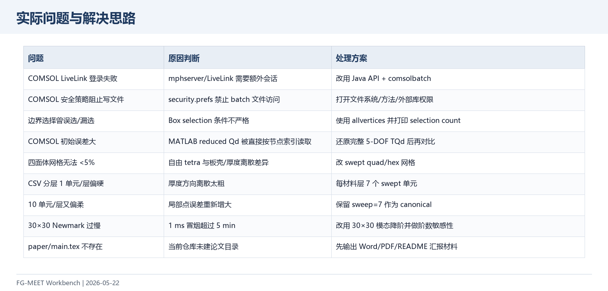

关键经验是：一开始不能只盯 COMSOL 网格，必须先排除 MATLAB reduced `Qd` 后处理错位。修正这个问题后，误差从“看起来 28% 最大误差”下降到 7% 左右，再通过 swept hex 网格和 CSV 分层材料把误差压到 5% 内。

## 4. MATLAB 主算例结果展示

### 4.1 Case A 机械压力

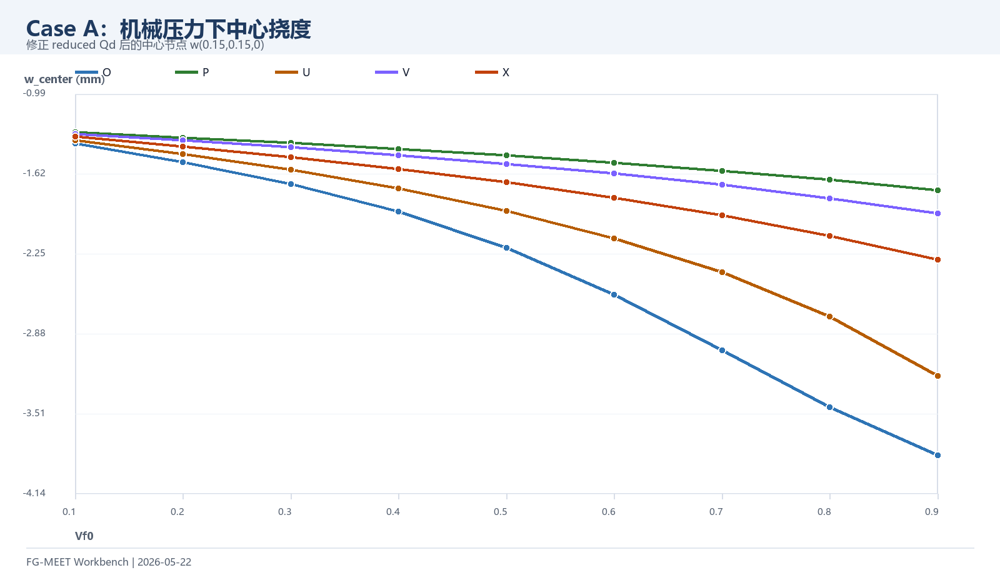

### 4.2 Case B 电势驱动

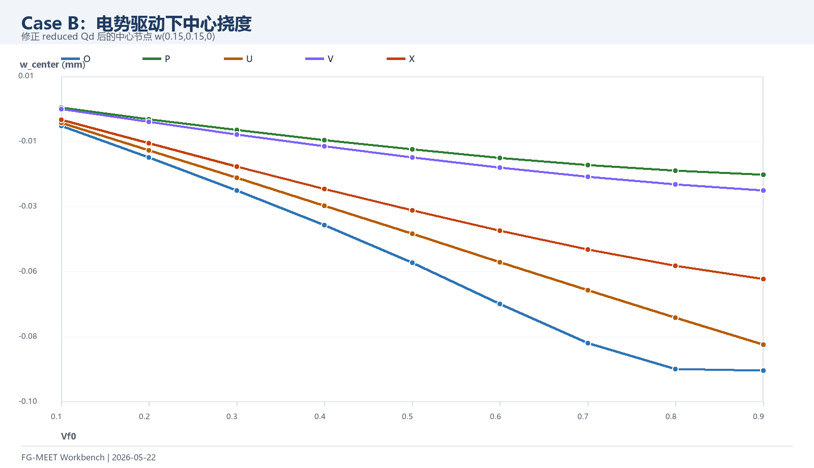

### 4.3 Case C 磁势驱动

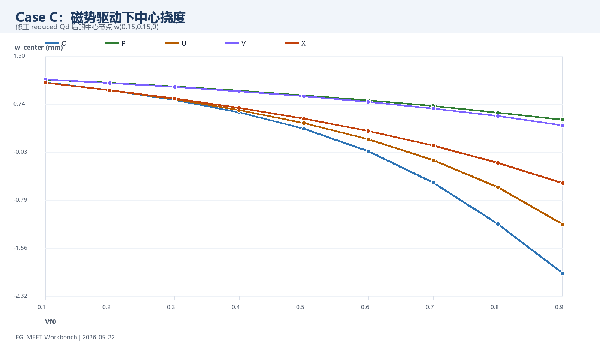

### 4.4 温差与磁电效率

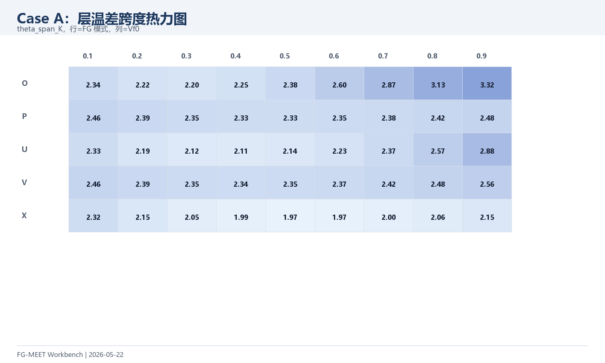

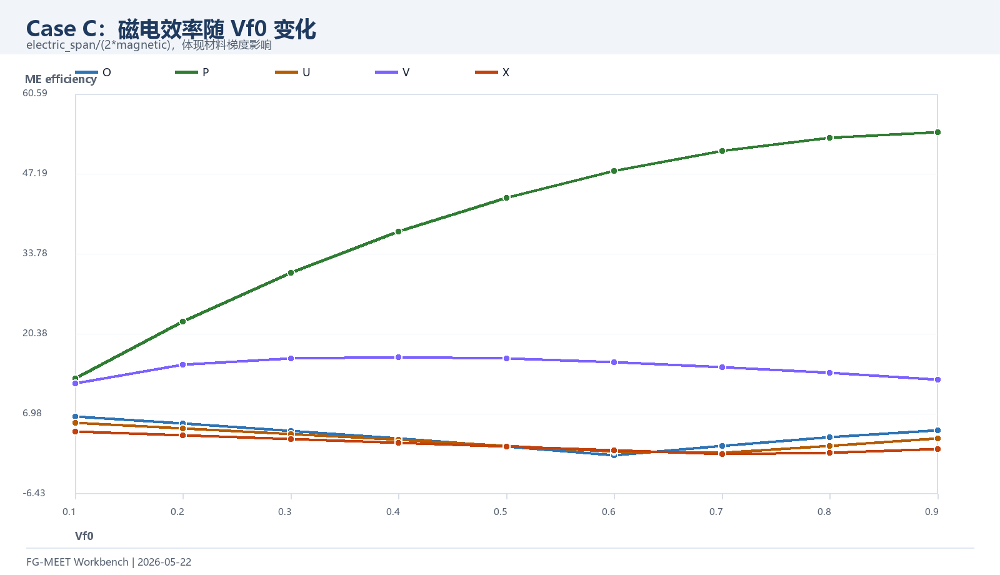

| 载荷 | 完成行数 |
| --- | --- |
| elastic | 45 |
| electro | 45 |
| magneto | 45 |
## 5. 结果修正：reduced Qd 还原

原先 `Qd` 是去除约束自由度后的 reduced 向量；若直接按 `5*(node-1)+3` 读取，会在固定边存在时错位。本次新增完整节点自由度还原 `TQd`，并刷新 `results_static.csv` 135 行。

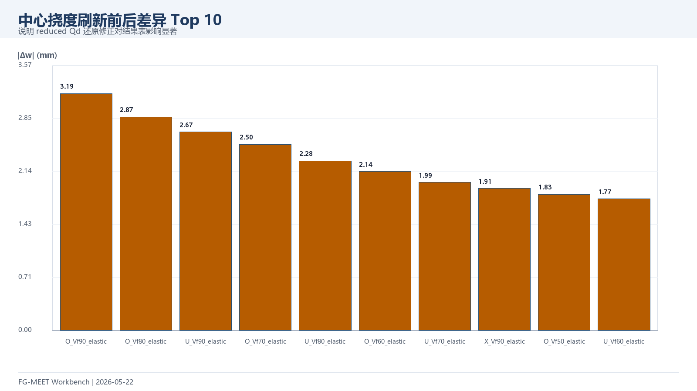

## 6. COMSOL 错误结果、筛选过程与最终方案

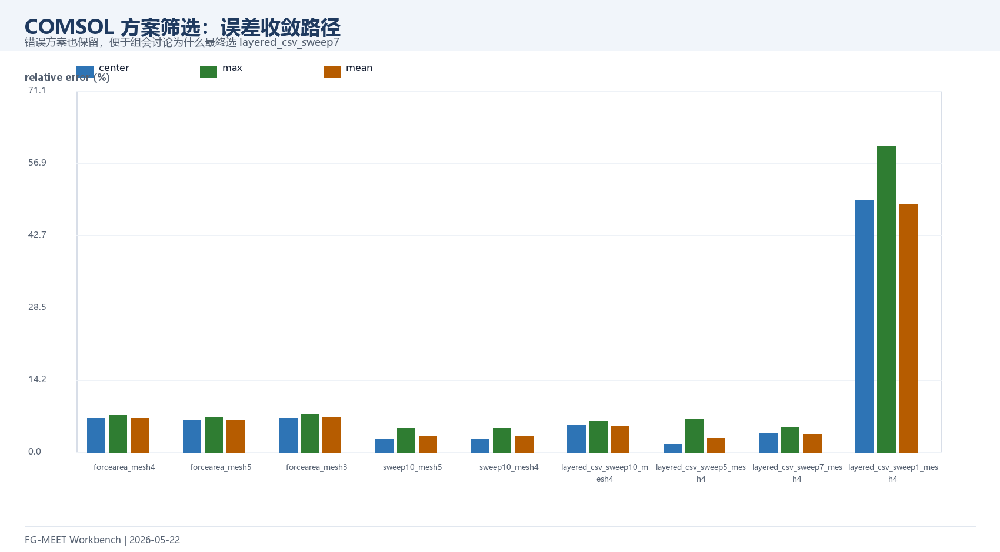

| 实验 | 中心误差% | 最大误差% | 平均误差% | 说明 |
| --- | --- | --- | --- | --- |
| forcearea_mesh4 | 6.66 | 7.307 | 6.743 | Corrected MATLAB reduced-DOF restoration; mesh refinement check |
| forcearea_mesh5 | 6.258 | 6.844 | 6.244 | Corrected MATLAB reduced-DOF restoration; ForceArea vertical load check |
| forcearea_mesh3 | 6.801 | 7.437 | 6.905 | Corrected MATLAB reduced-DOF restoration; mesh refinement check |
| sweep10_mesh5 | 2.516 | 4.714 | 3.079 | Corrected MATLAB reduced-DOF restoration; swept hex mesh check |
| sweep10_mesh4 | 2.524 | 4.704 | 3.083 | Corrected MATLAB reduced-DOF restoration; swept hex mesh refinement check |
| layered_csv_sweep10_mesh4 | 5.246 | 6.032 | 5.039 | Layer CSV import smoke check; U material is uniform across layers |
| layered_csv_sweep5_mesh4 | 1.541 | 6.407 | 2.708 | Layer CSV import check; U material is uniform across layers |
| layered_csv_sweep7_mesh4 | 3.771 | 4.927 | 3.513 | Layer CSV import check; U material is uniform across layers |
| layered_csv_sweep1_mesh4 | 49.656 | 60.294 | 48.882 | Layer CSV import check; too coarse through thickness |

结论：自由四面体网格细化并不能解决差异；单域 swept hex 可以达标，但为了回应“10 层材料 CSV 导入”的要求，最终选择 10-domain CSV + swept mesh。1 单元/层明显偏硬，10 单元/层局部偏柔，7 单元/层在 15 点内全部低于 5%。

## 7. 最终正确结果详尽展示

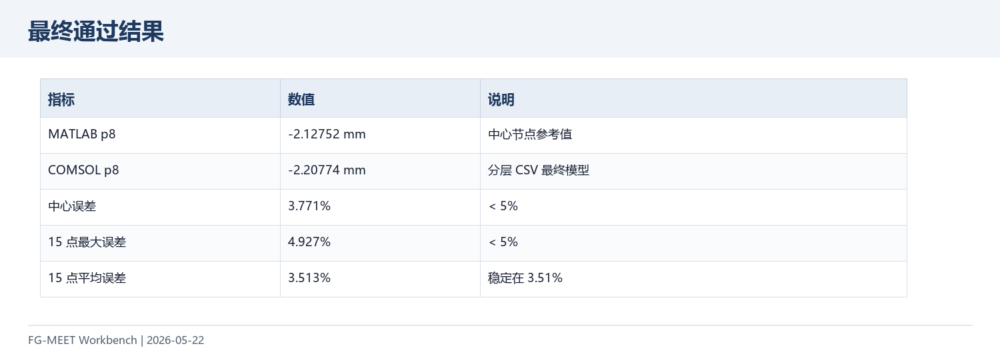

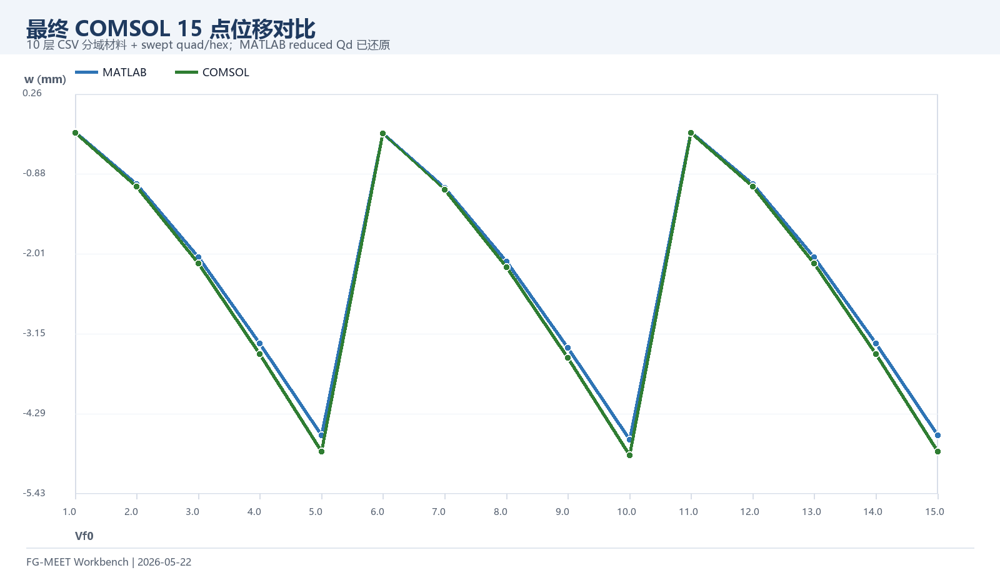

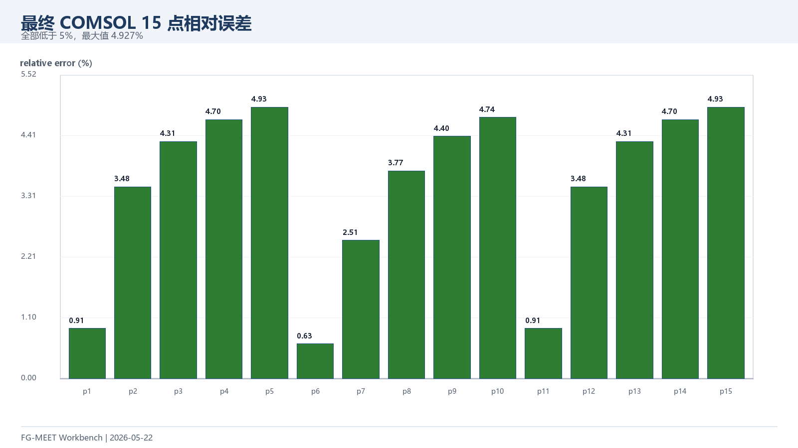

| 点 | x | y | MATLAB mm | COMSOL mm | 差值 mm | 误差% |
| --- | --- | --- | --- | --- | --- | --- |
| p1 | 0.05 | 0.05 | -0.2873 | -0.2899 | -0.0026 | 0.908 |
| p2 | 0.1 | 0.05 | -1.0231 | -1.0587 | -0.0356 | 3.4803 |
| p3 | 0.15 | 0.05 | -2.0645 | -2.1534 | -0.0889 | 4.3058 |
| p4 | 0.2 | 0.05 | -3.2881 | -3.4428 | -0.1546 | 4.7031 |
| p5 | 0.25 | 0.05 | -4.6001 | -4.8268 | -0.2266 | 4.9268 |
| p6 | 0.05 | 0.15 | -0.3046 | -0.3027 | 0.0019 | 0.6258 |
| p7 | 0.1 | 0.15 | -1.0711 | -1.0979 | -0.0269 | 2.5071 |
| p8 | 0.15 | 0.15 | -2.1275 | -2.2077 | -0.0802 | 3.7706 |
| p9 | 0.2 | 0.15 | -3.3517 | -3.4992 | -0.1475 | 4.3997 |
| p10 | 0.25 | 0.15 | -4.659 | -4.8799 | -0.2209 | 4.7411 |
| p11 | 0.05 | 0.25 | -0.2873 | -0.2899 | -0.0026 | 0.908 |
| p12 | 0.1 | 0.25 | -1.0231 | -1.0587 | -0.0356 | 3.4803 |
| p13 | 0.15 | 0.25 | -2.0645 | -2.1534 | -0.0889 | 4.3058 |
| p14 | 0.2 | 0.25 | -3.2881 | -3.4428 | -0.1546 | 4.7031 |
| p15 | 0.25 | 0.25 | -4.6001 | -4.8268 | -0.2266 | 4.9268 |
## 8. 2 mm 耦合验证结果

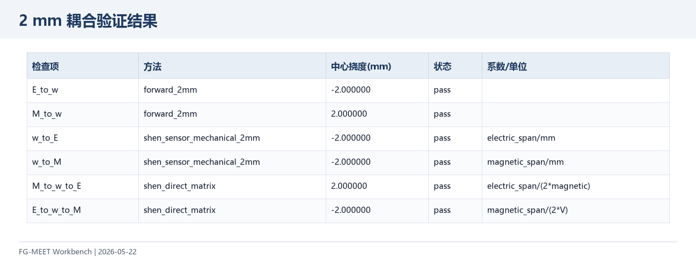

| 检查项 | 方法 | 驱动 | 驱动值 | 中心挠度 mm | 状态 | 系数 | 单位 |
| --- | --- | --- | --- | --- | --- | --- | --- |
| E_to_w | forward_2mm | electric_potential | 90075.32987 | -2.0 | pass | nan | nan |
| M_to_w | forward_2mm | magnetic_potential | 17974.262465 | 2.0 | pass | nan | nan |
| w_to_E | shen_sensor_mechanical_2mm | mechanical_load | -83134.178827 | -2.0 | pass | 1941.396052 | electric_span/mm |
| w_to_M | shen_sensor_mechanical_2mm | mechanical_load | -83134.178827 | -2.0 | pass | 2.009152 | magnetic_span/mm |
| M_to_w_to_E | shen_direct_matrix | magnetic_potential | 17974.262465 | 2.0 | pass | 0.590535 | electric_span/(2*magnetic) |
| E_to_w_to_M | shen_direct_matrix | electric_potential | 90075.32987 | -2.0 | pass | 0.000122 | magnetic_span/(2*V) |
## 9. 动力代表算例与 30×30 模态结果

| 方法 | 静态中心 mm | 动力峰值 mm | 峰值时间 ms | 一阶频率 Hz | 最大 θ 跨度 K |
| --- | --- | --- | --- | --- | --- |
| 10×10 Newmark pilot | -2.1284 | -4.4995 | 28.90 | 52.20 | 5.1311 |
| 30×30 8 阶模态 | -2.2947 | -4.4279 | 9.50 | 52.20 | 5.0398 |
| 30×30 16 阶模态 | -2.2947 | -4.4270 | 9.60 | 52.20 | 5.0363 |

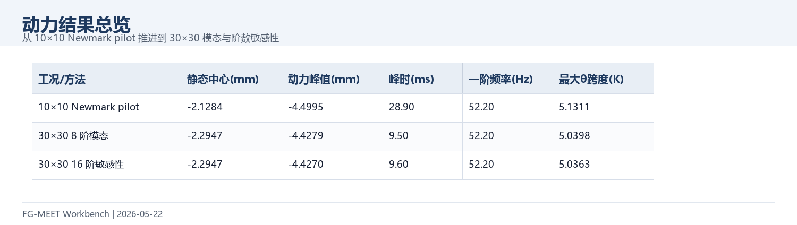

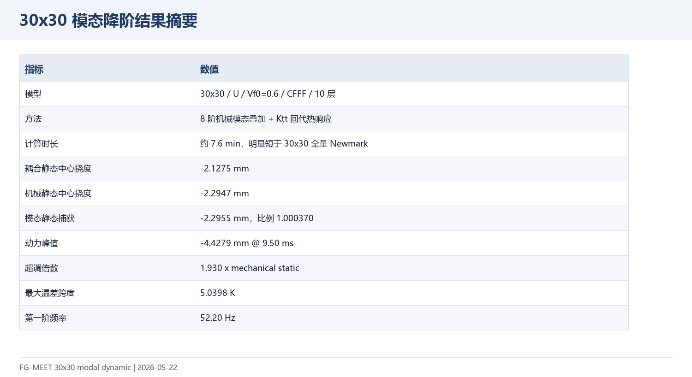

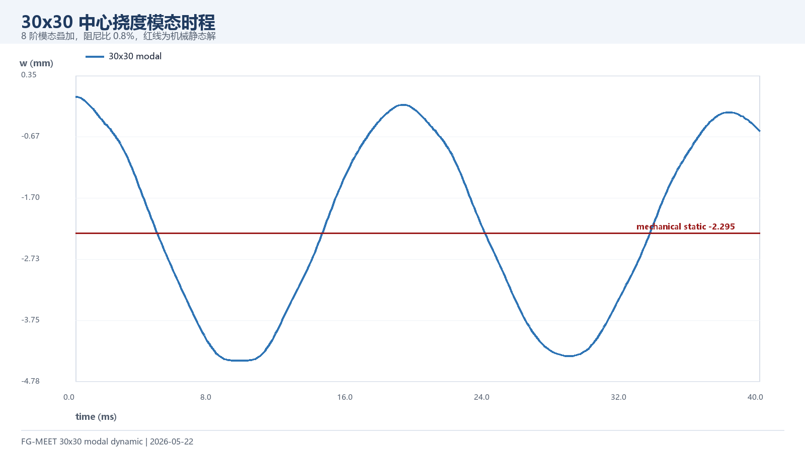

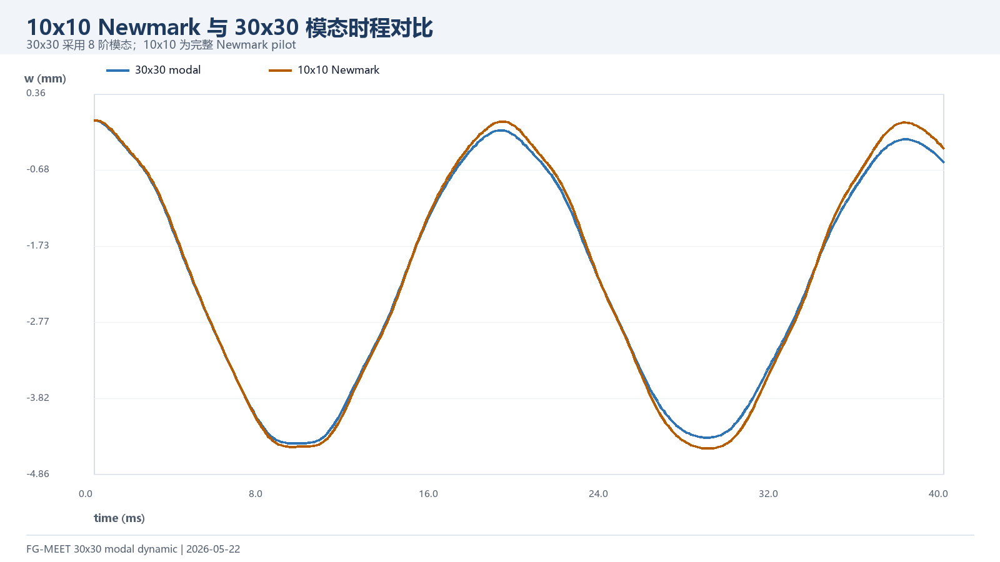

## 10. 模态阶数敏感性

| 阶数 | 静态捕获 | 峰值 mm | 峰值时间 ms | 超调 | 最大 θ 跨度 K |
| --- | --- | --- | --- | --- | --- |
| 4.0 | 1.000349 | -4.428136 | 9.5 | 1.929725 | 5.025591 |
| 6.0 | 1.000053 | -4.427098 | 9.6 | 1.929273 | 5.027648 |
| 8.0 | 1.00037 | -4.427879 | 9.5 | 1.929613 | 5.039809 |
| 12.0 | 1.000361 | -4.427848 | 9.5 | 1.929599 | 5.03984 |
| 16.0 | 0.999965 | -4.426965 | 9.6 | 1.929214 | 5.036322 |

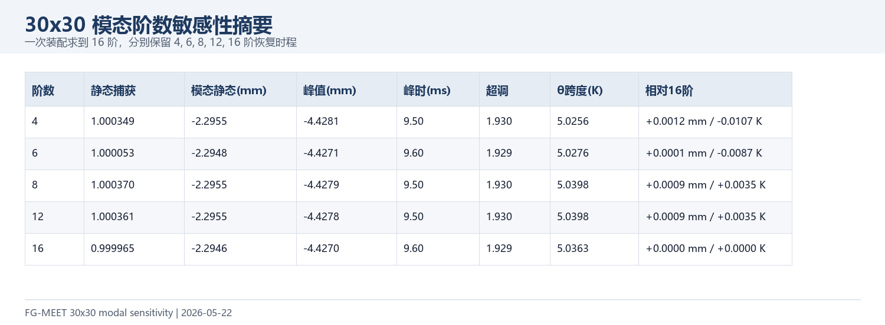

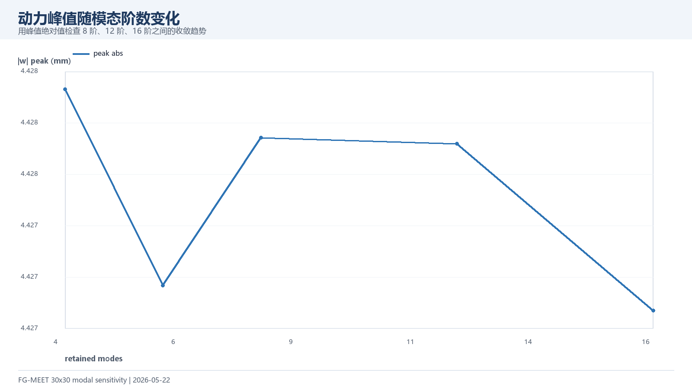

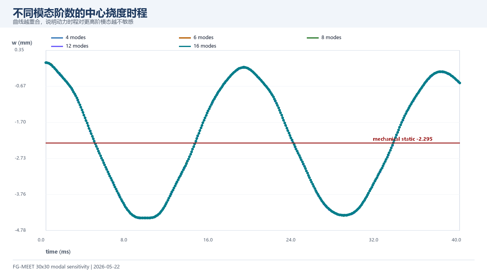

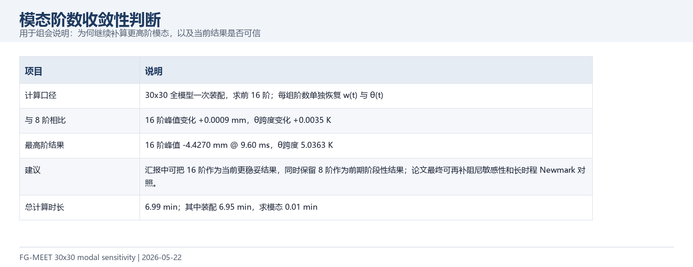

结论：16 阶峰值为 -4.4270 mm，与 8 阶峰值绝对值差约 0.0009 mm；8 阶结果已基本收敛，汇报中可把 16 阶作为稳妥口径。

## 11. 阻尼敏感性

| 阻尼比 | 峰值 mm | 峰值时间 ms | 超调 | 40 ms 位移 mm | 最大 θ 跨度 K |
| --- | --- | --- | --- | --- | --- |
| 0.0% | -4.503943 | 28.9 | 1.96276 | -0.412865 | 5.113388 |
| 0.5% | -4.444669 | 9.6 | 1.93693 | -0.520488 | 5.064735 |
| 0.8% | -4.426965 | 9.6 | 1.929214 | -0.582984 | 5.036322 |
| 1.5% | -4.38578 | 9.6 | 1.911267 | -0.721649 | 4.972045 |

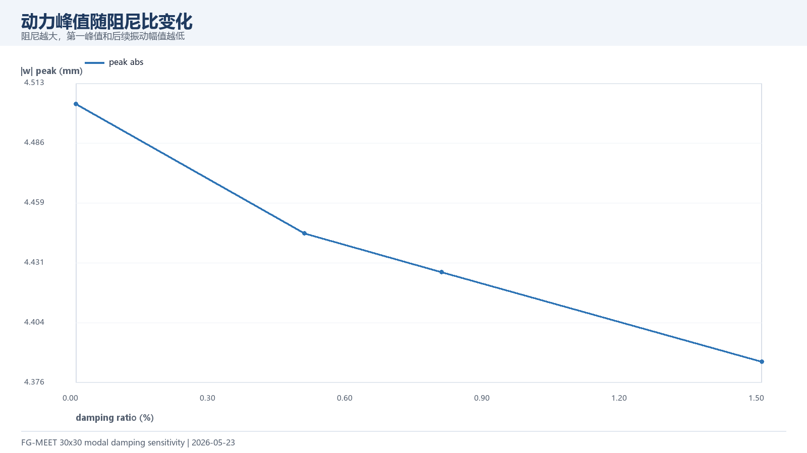

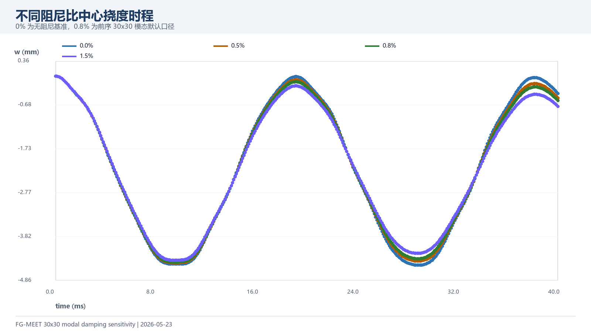

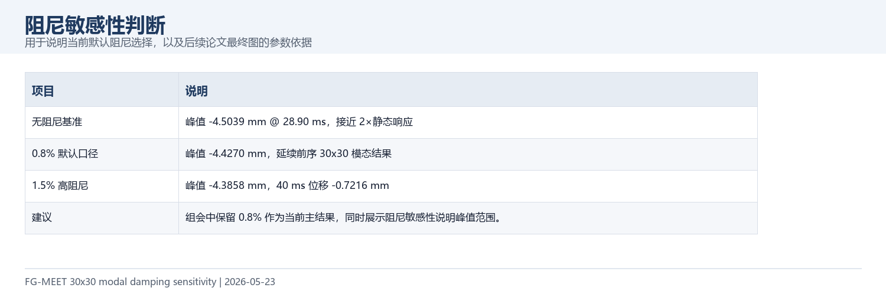

## 12. 当前未解决/下一步

| 事项 | 当前状态 | 建议处理 |
| --- | --- | --- |
| 长时程 Newmark 对照 | 30×30 全量 Newmark 交互运行过慢 | 可作为夜间长任务跑 1 个短窗或降采样对照 |
| 论文文件 | 当前无 `paper/main.tex` 目录 | 动力数据稳定后再创建论文图表和 LaTeX |
| 非 U 的 COMSOL 分层验证 | 脚本已支持 `FG_COMSOL_LAYER_CSV`，但还未批量验证 V/X/O/P | 选择 1-2 个代表 FG 模式做补充对照 |
| COMSOL .mph 大文件 | 已生成但未纳入 Git | 保留本地，GitHub 提交轻量 CSV/图表/脚本 |
## 13. 附：文件索引

| 文件 | 路径 |
| --- | --- |
| Word 汇报文件 | FG_MEET_progress_report_2026-05-22.docx |
| PDF 汇报文件 | rendered-word/FG_MEET_progress_report_2026-05-22.pdf |
| 本文 README | README.md |
| 图表目录 | figures/ |
| 轻量结果 CSV | data/ |
| 最终 COMSOL 验证表 | data/validation_log.csv |
| 最终 15 点验证表 | data/validation_points_U_Vf06_elastic.csv |
| 动力敏感性表 | data/dynamic_modal_30x30_U_Vf06_elastic_sensitivity_summary.csv |
| 阻尼敏感性表 | data/dynamic_modal_30x30_U_Vf06_elastic_damping_sensitivity_summary.csv |