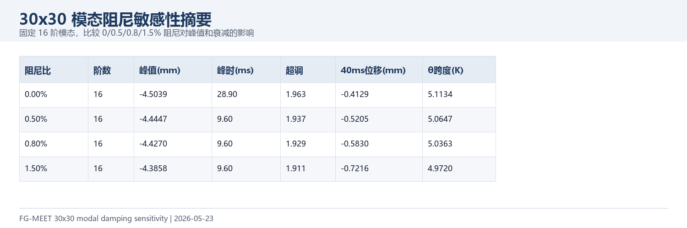
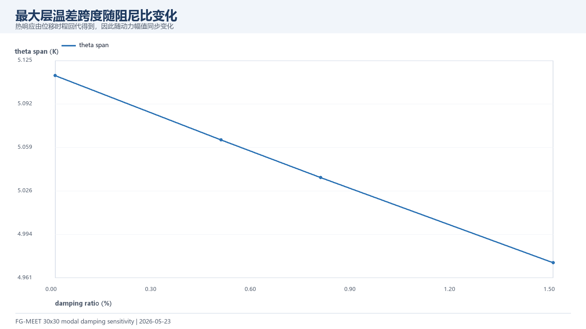
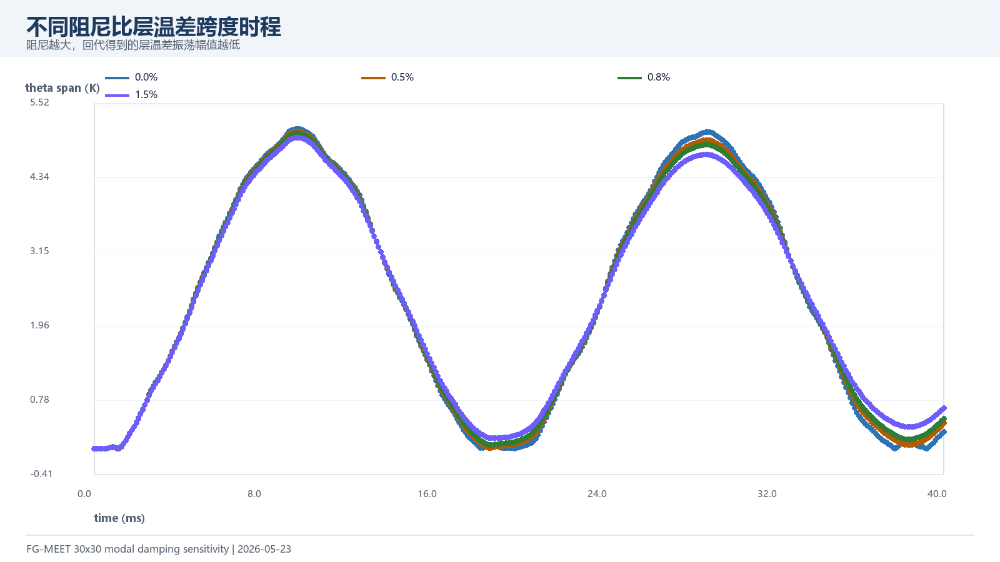

# 30x30 模态阻尼敏感性分析（2026-05-23）

本报告在阶数敏感性之后继续补充阻尼比检查。计算固定 16 阶模态，分别取 0.00%, 0.50%, 0.80%, 1.50% 阻尼比，输出中心挠度、层温差跨度和峰值摘要。

## 1. 核心结果

| 阻尼比 | 峰值 mm | 峰值时间 ms | 超调倍数 | 40 ms 位移 mm | 最大 θ 跨度 K |
| --- | ---: | ---: | ---: | ---: | ---: |
| 0.00% | -4.5039 | 28.90 | 1.963 | -0.4129 | 5.1134 |
| 0.50% | -4.4447 | 9.60 | 1.937 | -0.5205 | 5.0647 |
| 0.80% | -4.4270 | 9.60 | 1.929 | -0.5830 | 5.0363 |
| 1.50% | -4.3858 | 9.60 | 1.911 | -0.7216 | 4.9720 |

## 2. 趋势图

## 3. 时程图

## 4. 讨论口径

当前建议：论文或组会主图仍可沿用 0.8% 阻尼；同时展示无阻尼到 1.5% 的范围，说明动力峰值对阻尼的敏感程度。若后续需要最终论文图，建议再把阻尼取值与材料/结构实验或文献区间对齐。

## 5. 文件索引

| 文件 | 用途 |
| --- | --- |
| `data/dynamic_modal_30x30_U_Vf06_elastic_damping_sensitivity_summary.csv` | 各阻尼比峰值、超调、温差和运行时间 |
| `data/dynamic_modal_30x30_U_Vf06_elastic_damping_sensitivity_timeseries.csv` | 各阻尼比中心挠度和层温差时程 |
| `data/dynamic_modal_30x30_U_Vf06_elastic_damping_sensitivity_modes.csv` | 16 阶模态频率和静态贡献 |
| `figures/*.png` | 可直接截取进 PPT 的阻尼敏感性图片 |
| `../../run_dynamic_modal_sensitivity_30x30.m` | 支持多阻尼比的一次装配计算入口 |
