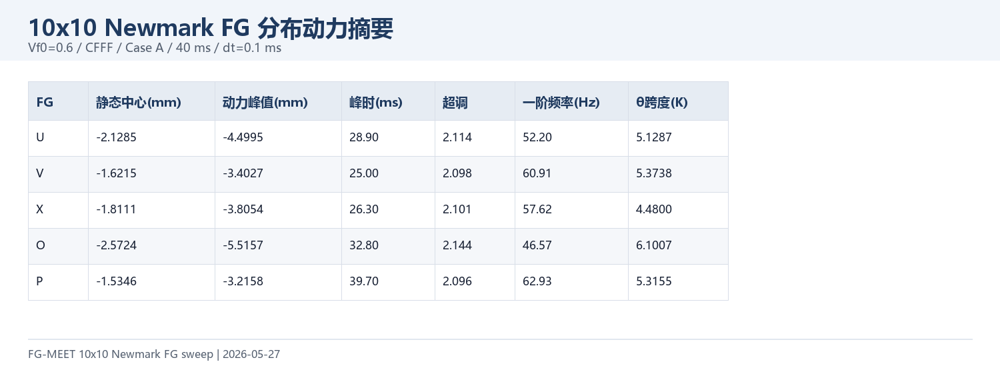
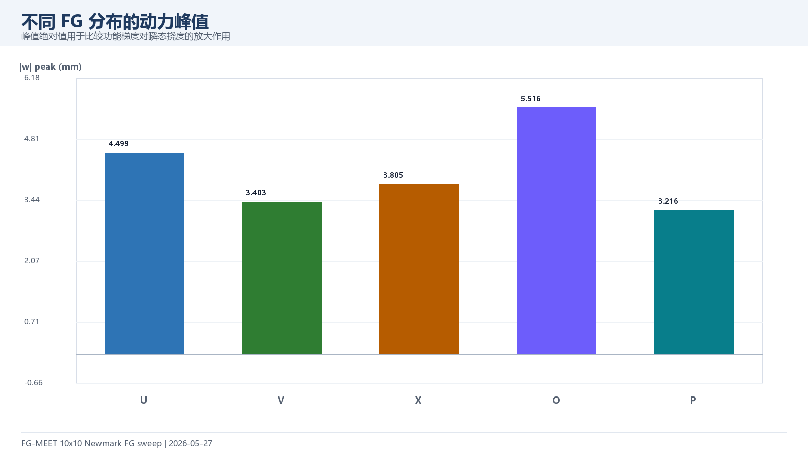
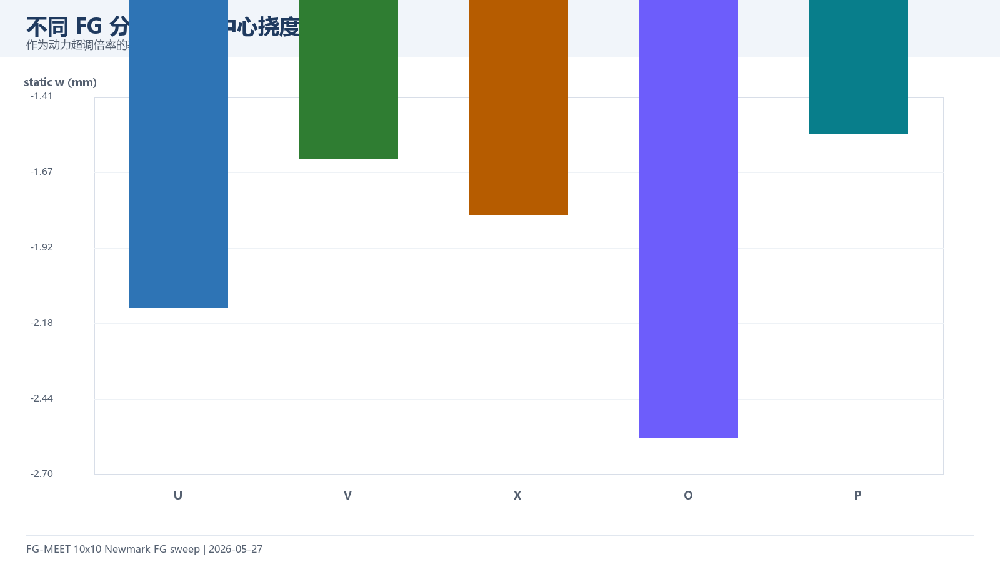
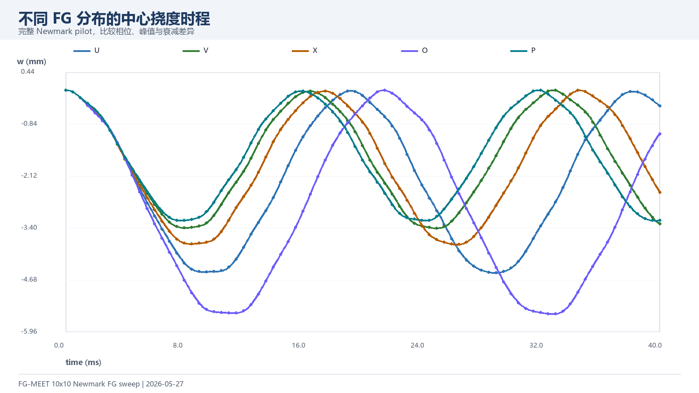
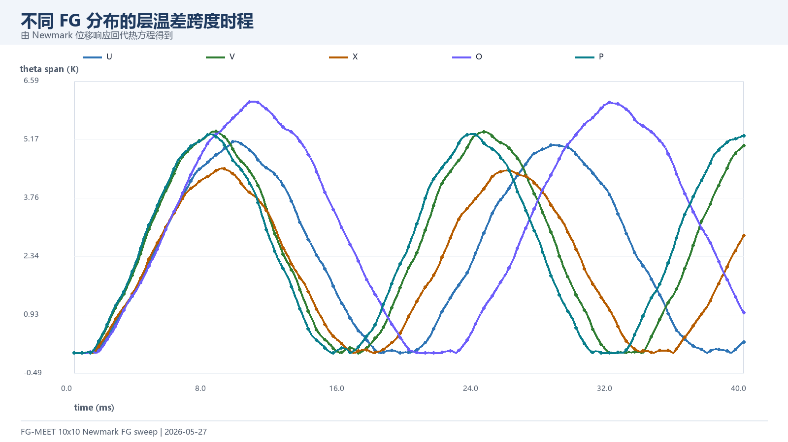
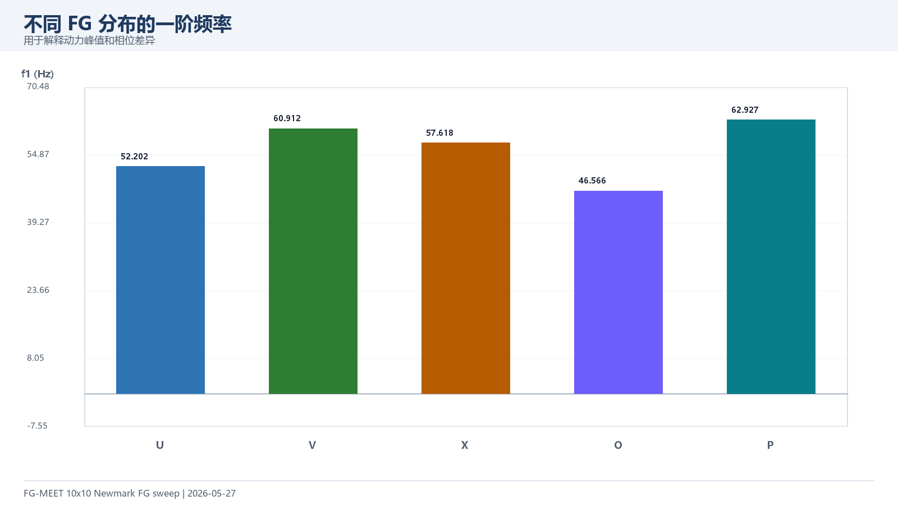

# 10x10 Newmark FG 分布动力扫描（2026-05-27）

本实验是在 30x30 非 U 分布直接装配出现内存峰值后，改用更稳的 10x10 完整 Newmark pilot 做新内容扩展。工况固定为 Vf0=0.6、CFFF、Case A 机械压力、40 ms 时程、dt=0.1 ms，比较 U/V/X/O/P 五种功能梯度分布。

## 1. 核心结果

| FG | 静态中心 mm | 动力峰值 mm | 峰值时间 ms | 超调倍数 | 一阶频率 Hz | 最大 θ 跨度 K |
| --- | ---: | ---: | ---: | ---: | ---: | ---: |
| U | -2.1285 | -4.4995 | 28.90 | 2.114 | 52.20 | 5.1287 |
| V | -1.6215 | -3.4027 | 25.00 | 2.098 | 60.91 | 5.3738 |
| X | -1.8111 | -3.8054 | 26.30 | 2.101 | 57.62 | 4.4800 |
| O | -2.5724 | -5.5157 | 32.80 | 2.144 | 46.57 | 6.1007 |
| P | -1.5346 | -3.2158 | 39.70 | 2.096 | 62.93 | 5.3155 |

峰值绝对值最小的是 P（3.2158 mm），最大的是 O（5.5157 mm）。这组结果可作为后续 30x30 FG 分布模态实验的低成本先验。

## 2. 峰值与静态基准

## 3. 时程对比

## 4. 频率对比

## 5. 文件索引

| 文件 | 用途 |
| --- | --- |
| `data/*_summary.csv` | 各 FG 分布的峰值、频率、温差摘要 |
| `data/*_timeseries.csv` | 各 FG 分布的中心挠度和温差时程 |
| `figures/*.png` | 可直接截入 PPT 的图表 |
| `../../tools/generate_dynamic_10x10_cases.py` | 10x10 FG 输入文件生成 |
| `../../run_dynamic_representative.m` | Newmark pilot 入口 |
