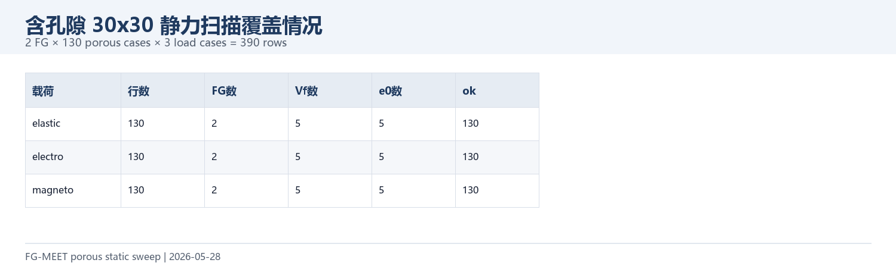
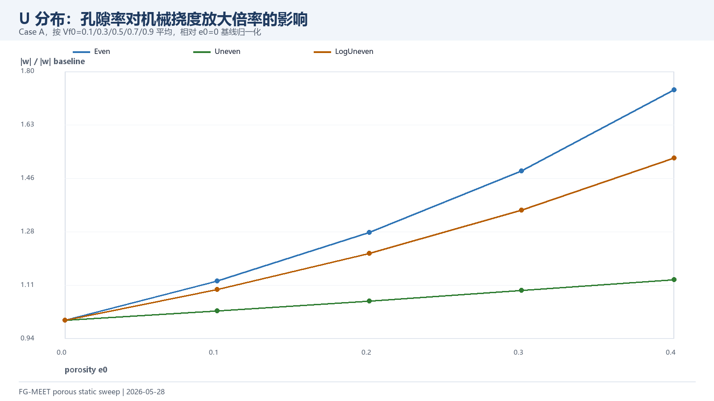
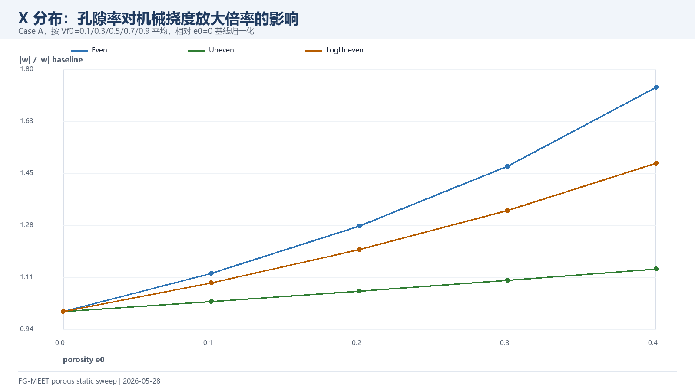
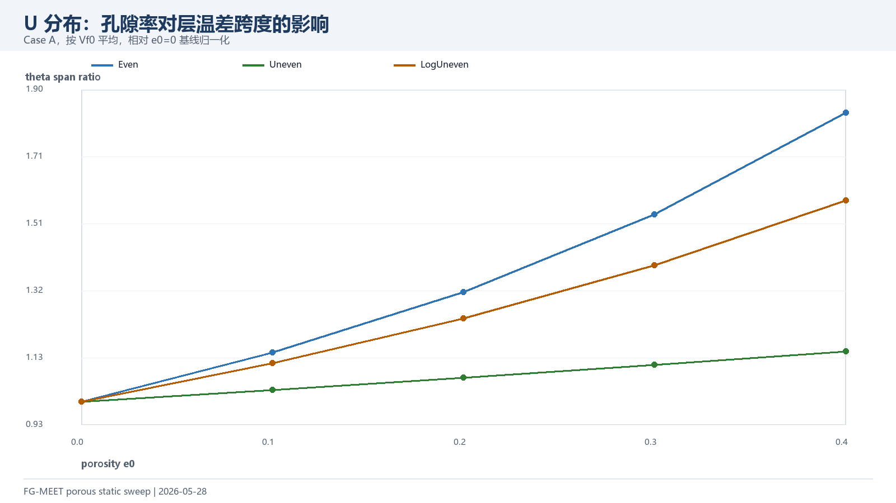
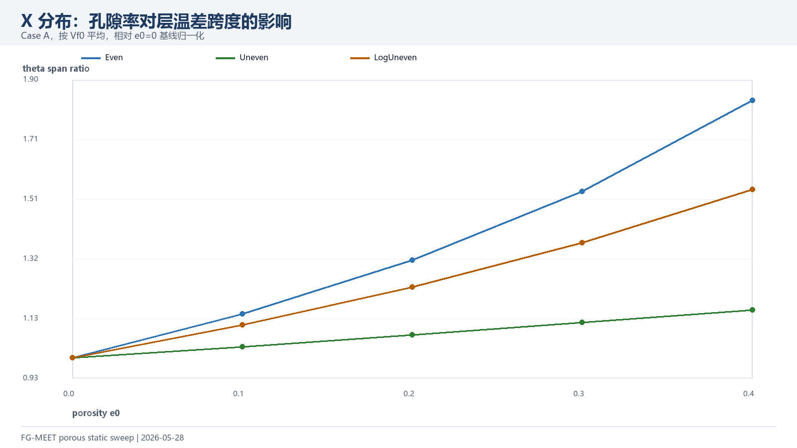
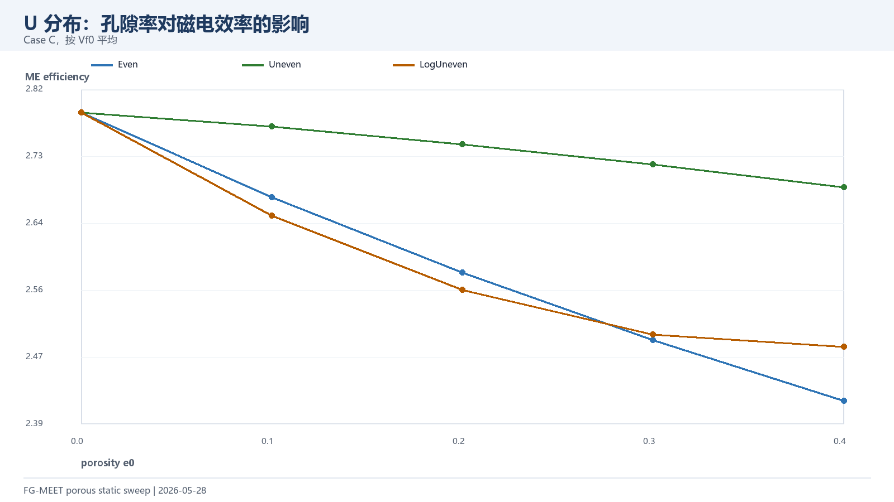
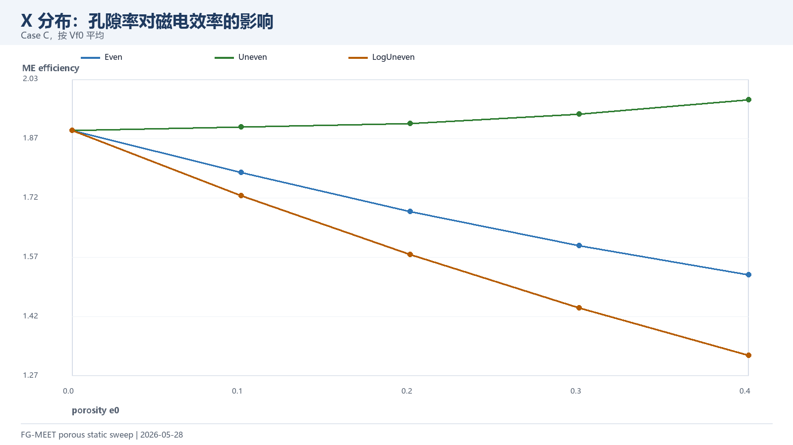
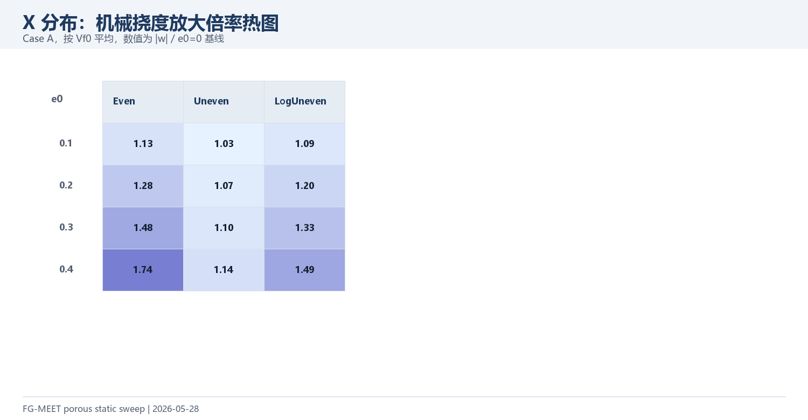
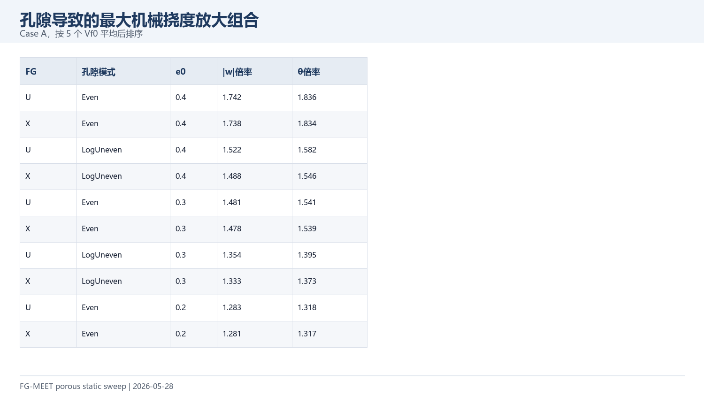

# 含孔隙 FG-MEE 30x30 静力扫描（2026-05-28）

本报告基于 `output/results_static_porous.csv`，覆盖 U/X 两种 FG 分布、5 个体积分数、5 个孔隙率水平和 3 种孔隙分布模式。`e0=0` 时三种孔隙模式等价，因此只保留 Even 基线；共 130 个输入算例、390 行三载荷结果。

## 1. 数据质量

| 项目 | 数值 |
| --- | ---: |
| 总结果行数 | 390 |
| 成功行数 | 390 |
| FG 分布 | 2 |
| 体积分数水平 | 5 |
| 孔隙率水平 | 5 |

## 2. 主要规律

- 机械挠度放大最强的平均组合是 U-Even-e0=0.4，相对无孔隙基线放大 1.742 倍。
- 机械挠度放大最弱的平均组合是 U-Uneven-e0=0.1，相对基线为 1.031 倍。
- 磁电效率最高的平均组合是 U-Uneven-e0=0.1，平均效率 2.7678。
- 磁电效率最低的平均组合是 X-LogUneven-e0=0.4，平均效率 1.3178。

## 3. 图表索引

## 4. 文件索引

| 文件 | 用途 |
| --- | --- |
| `data/results_static_porous.csv` | 原始 390 行结果 |
| `data/results_static_porous_with_baseline_ratios.csv` | 增加相对 e0=0 基线倍率 |
| `data/porous_static_summary_by_group.csv` | 按载荷/FG/孔隙模式/e0 汇总 |
| `figures/*.png` | 可直接截入论文或汇报 |
